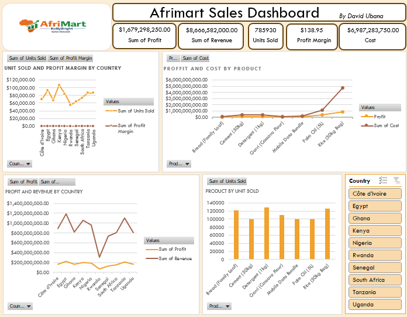

# Afrimart Sales & Profitability Dashboard (Excel)

## Overview
An interactive Excel dashboard analyzing sales and profitability performance 
for Afrimart across 10 African countries and 7 product categories. The raw 
dataset was cleaned, then pivot tables were used to build a dashboard with 
cross-filtering and key performance metrics.

## Business Questions Answered
- Which countries generate the most revenue and profit, and which are most 
  profitable on margin, not just on volume?
- Which products drive the most sales volume, and which drive the most profit?
- How does profit margin vary across countries and across products?
- Where is revenue concentrated, and does that concentration align with 
  where margins are strongest?

## Key KPIs
- Total Profit
- Total Revenue
- Units Sold
- Profit Margin
- Total Cost

## Tools Used
- Microsoft Excel
  - Pivot Tables
  - Pivot Charts
  - Slicers (dynamic, cross-filtered)
  - Formulas (Profit Margin calculation)

## Dataset
- **Source:** Afrimart / KollyBright sales records
- **Scope:** 525 transaction records across 10 countries (Côte d'Ivoire, 
  Egypt, Ghana, Kenya, Nigeria, Rwanda, Senegal, South Africa, Tanzania, 
  Uganda) and 7 products (Bread, Cement, Detergent, Garri, Mobile Data 
  Bundle, Palm Oil, Rice)
- **Fields:** Country, Product, Units Sold, Revenue, Cost, Profit, Date, 
  Profit Margin
- **Cleaning:** The original raw export was reviewed and cleaned (deduped, 
  validated, profit margin calculated) before being used to build the 
  pivot tables and dashboard

## Dashboard Overview
Built pivot table dashboards covering:
- Profit and revenue by country
- Units sold and profit margin by country
- Profit and cost by product
- Product and units sold by country

A dynamic country slicer was connected across all visuals, enabling 
cross-filtering of every chart and KPI from a single control.

## Key Insights
- **Revenue is concentrated in one product.** Rice (50kg Bag) accounts for 
  $5.64B of the $8.67B total revenue (~65%) and $878M of total profit 
  (~52%) — but its margin, at 15.56%, is the second-lowest of all products.
- **Volume and revenue leaders aren't the same product.** Detergent (1kg) 
  sells the most units (129,422), ahead of Rice (125,433), but its lower 
  price point means it contributes far less revenue.
- **Mobile Data Bundle is the most efficient product, by far.** It posts 
  the highest margin of any product (40%) while using only ~3.5% of total 
  revenue — a high-margin line that's small relative to the physical goods.
- **Egypt leads on revenue and profit, but not on margin.** Egypt tops 
  both revenue ($1.18B) and profit ($223M), yet its margin (18.80%) sits 
  below the portfolio average.
- **Rwanda is the smallest market but the most efficient.** Rwanda has the 
  lowest revenue of any country ($313M) and the highest margin (24.00%).
- **Senegal has the weakest margin.** At 18.08%, Senegal trails every 
  other country despite a mid-table revenue of $730M.
- **Cement and Rice share the thinnest margins** (16.00% and 15.56%), 
  making them the two products most exposed to cost increases.

## Conclusion
This dashboard gives stakeholders — for example, regional sales or 
category managers — a single view to separate revenue volume from 
profitability. The headline numbers favor Rice and Egypt, but the margin 
view shows the real efficiency story: Mobile Data Bundle and Rwanda punch 
above their revenue weight, while Rice, Cement, and Senegal carry the 
portfolio's thinnest margins. That reframes the natural next question from 
"where do we sell the most?" to "where should we actually focus to grow 
profit, not just revenue?"

## How to Use
1. Download/clone the Excel file from this repository
2. Open in Excel (enable data connections if prompted)
3. Use the country slicer to filter all dashboard views and KPIs at once
